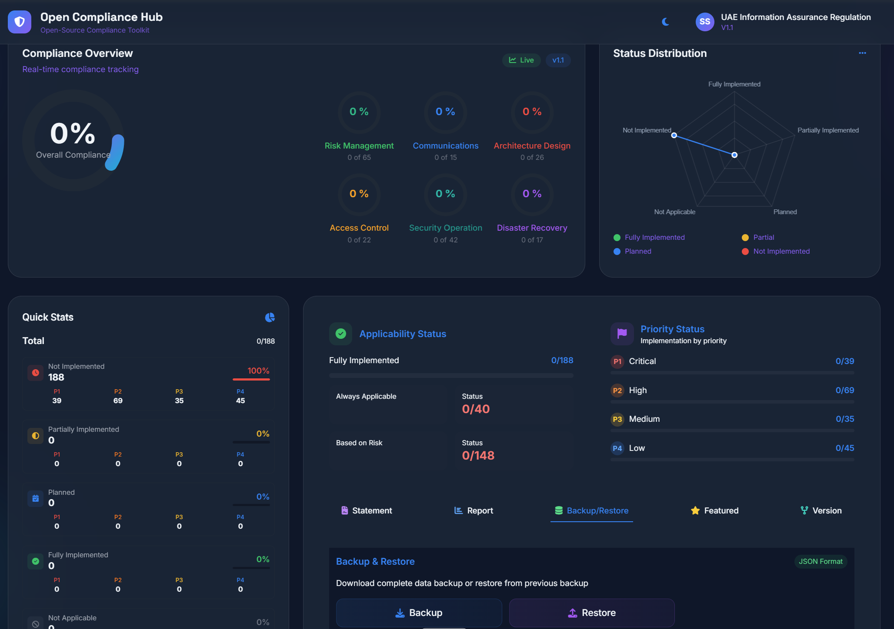
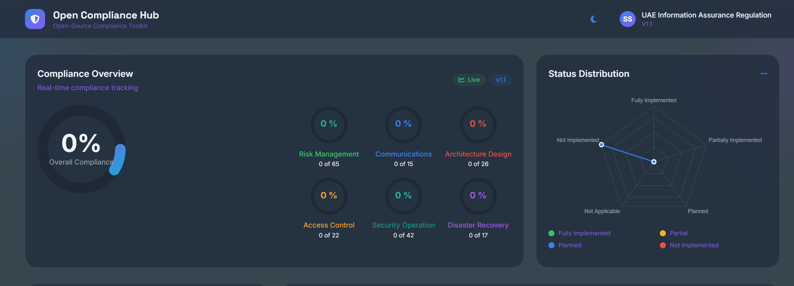
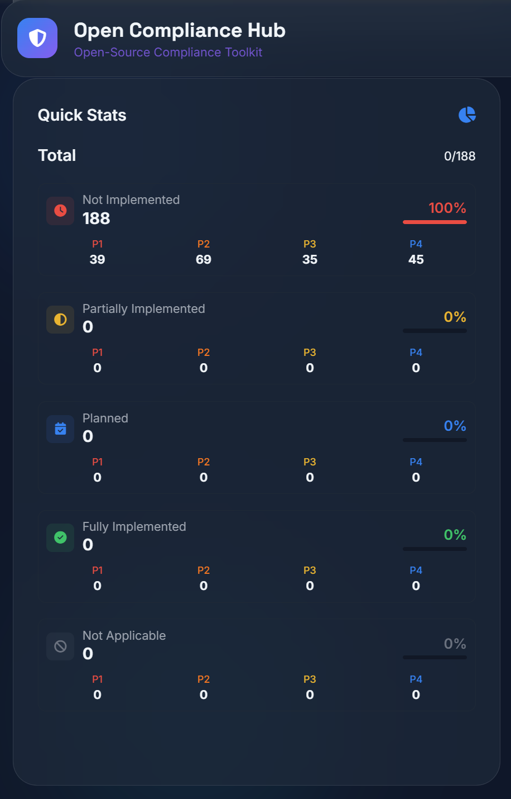
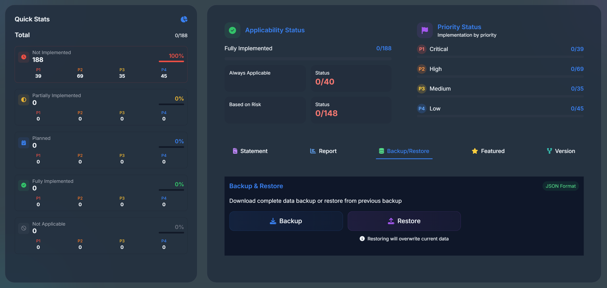
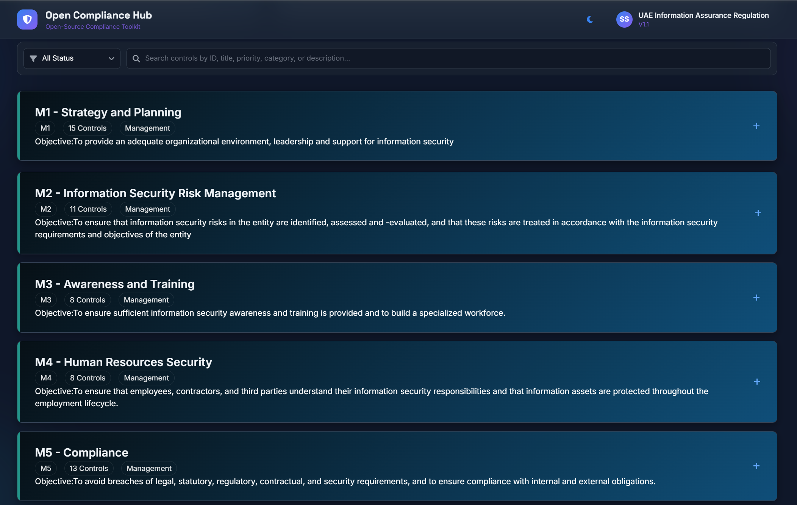

# Open Compliance Hub – UAE IAR Compliance Portal


Lightweight • Open Source • Audit-Ready • Executive Dashboards

---

## Overview

**Open Compliance Hub** is a lightweight, open-source compliance management platform designed to help organizations **assess, track, and report** their implementation of **UAE Information Assurance Regulation (UAE IAR v1.1)** controls.

It provides:

* Real-time executive visibility
* Risk-based implementation tracking
* Session-based working environment
* Versioned backups & snapshots
* Audit-ready reporting

Ideal for organizations preparing for **UAE IA certification** or building **continuous compliance programs**.


---

## Key Value

* Real-time compliance posture visibility
* Executive dashboards for leadership
* Risk & priority-driven control tracking
* Centralized UAE IAR control library
* Statement of Applicability (SoA) generation
* Monthly / yearly compliance snapshots
* JSON backup & restore
* Zero-cost open-source alternative to commercial GRC tools

---

## Screenshots







[Executive Dashboard](docs/images/executive-dashboard.png)
[Domain Compliance](docs/images/domain-view.png)
[Priority Tracking](docs/images/priority.png)
[Export Center](docs/images/export.png)


---

## Core Features

### Executive Dashboard

* Overall compliance percentage
* Domain-wise maturity view
* Implementation status distribution
* Documentation coverage
* Real-time posture monitoring

### Control Management

* Complete **UAE IAR v1.1** control library
* Status tracking:

  * Fully Implemented
  * Partially Implemented
  * Planned
  * Not Implemented
  * Not Applicable
* Bulk updates and filtering

### Risk & Priority Tracking

* Applicability:

  * Always Applicable
  * Risk-Based
* Priority Levels:

  * P1 – Critical
  * P2 – High
  * P3 – Medium
  * P4 – Low
* Critical control progress monitoring

### Reporting & Audit

* Statement of Applicability (SoA)
* Full control export
* PDF & Excel formats
* Audit-ready structure

### Data Management & Version Control

* Session-based working
* JSON backup & restore
* Monthly / yearly snapshots
* Historical version tracking
* Framework reset & initialization
* Full data portability

---

## Available Dashboards

| Dashboard               | Purpose                            |
| ----------------------- | ---------------------------------- |
| Executive Summary       | Leadership view of overall posture |
| Domain Compliance       | Operational monitoring by domain   |
| Priority Dashboard      | Risk-based implementation tracking |
| Applicability Dashboard | SoA and applicability management   |
| Status Distribution     | Implementation maturity analysis   |
| Export Center           | Audit and reporting downloads      |

---

## Architecture

```
Users (CISO / Compliance / Auditor)
        ↓
Web Frontend (Session-Based)
        ↓
Compliance Engine
        ↓
Data Layer
 - Control Repository
 - Session Data
 - Version Snapshots
 - Monthly / Yearly Backups
        ↓
Export / Restore
(PDF | Excel | JSON)
```

---

## Target Users

* CISO / CIO
* Compliance & Risk Teams
* Internal / External Auditors
* IT & Security Teams
* Consultants / Assessors

---

## Deployment

* Web server deployment
* Client session-based operation
* Built-in Backup / Restore

---

## Ideal Use Cases

* UAE IA certification readiness
* Compliance gap assessment
* Executive reporting
* Continuous compliance monitoring
* Annual audit preparation

---

## Roadmap

Planned enhancements:

* Risk Register module
* System Hardening Checklist
* Multi-framework support

  * CIS Controls
  * NIST CSF
  * Other Global Frameworks
* Evidence repository
* Role-Based Access Control (RBAC)
* API integration with SIEM / GRC tools

---

## Repository Structure

```
open-compliance-hub/
│
├── docs/
│   └── images/
├── data/
│   └── backups/
├── src/
├── reports/
├── README.md
└── LICENSE
```

---

## License & Legal

This project is provided as an open-source compliance tool and is subject to the following:
* MIT License
* Terms & Conditions
  [https://sajinshivdas.com/cybersecurity/terms-and-conditions/](https://sajinshivdas.com/cybersecurity/terms-and-conditions/)

### Legal Policies

| Policy             | Link                                                                                                                         |
| ------------------ | ---------------------------------------------------------------------------------------------------------------------------- |
| Privacy Policy     | [https://sajinshivdas.com/cybersecurity/privacy-policy/](https://sajinshivdas.com/cybersecurity/privacy-policy/)             |
| Terms & Conditions | [https://sajinshivdas.com/cybersecurity/terms-and-conditions/](https://sajinshivdas.com/cybersecurity/terms-and-conditions/) |
| Disclaimer         | [https://sajinshivdas.com/cybersecurity/disclaimer/](https://sajinshivdas.com/cybersecurity/disclaimer/)                     |
| Cookies Policy     | [https://sajinshivdas.com/cybersecurity/cookies-policy/](https://sajinshivdas.com/cybersecurity/cookies-policy/)             |

---

## Important Notice

* Provided **“as is”** without warranties
* Intended for compliance tracking and informational purposes only
* Users must validate compliance against official regulatory requirements
* Maintainers are not liable for decisions made using this tool

---

## Maintainer

**Sajin Shivdas – Cybersecurity**

---

## Connect

<!-- Socials -->
<p align="center">
<a href="https://sajinshivdas.com/cybersecurity/">
  
</a>
<a href="https://sajinshivdas.com/compliance/uaeiar/">
  
</a>
<a href="https://www.linkedin.com/in/sajin-shivdas/">
  
</a>
<a href="https://x.com/sajin1424">
  
</a>
<a href="https://www.instagram.com/sajin.shivdas/">
  
</a>
<a href="https://in.pinterest.com/sajinshivdas/">
  
</a>
</p>

<p align="center"><a href="https://sajinshivdas.com/"><sup>www.sajinshivdas.com</sup></a></p>
